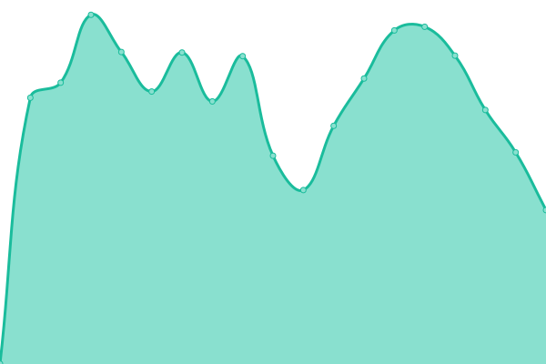
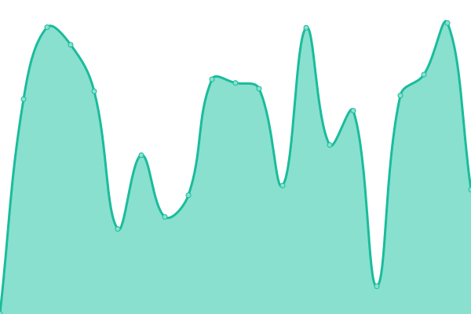

# [📈 Live Status](https://demo.upptime.js.org): <!--live status--> **🟧 Partial outage**

This repository contains the open-source uptime monitor and status page for [Motif Technologies](https://demo.upptime.js.org), powered by [Upptime](https://github.com/upptime/upptime).

With [Upptime](https://upptime.js.org), you can get your own unlimited and free uptime monitor and status page, powered entirely by a GitHub repository. We use [Issues](https://github.com/Motiftechnologies/upptime-infra/issues) as incident reports, [Actions](https://github.com/Motiftechnologies/upptime-infra/actions) as uptime monitors, and [Pages](https://demo.upptime.js.org) for the status page.

<!--start: status pages-->
<!-- This summary is generated by Upptime (https://github.com/upptime/upptime) -->
<!-- Do not edit this manually, your changes will be overwritten -->
<!-- prettier-ignore -->
| URL | Status | History | Response Time | Uptime |
| --- | ------ | ------- | ------------- | ------ |
|  [ib-topo-web](https://ib-topo-web.motiftech.io/) | 🟥 Down | [ib-topo-web.yml](https://github.com/MotifTechnologies/upptime-infra/commits/HEAD/history/ib-topo-web.yml) | 

 1037ms
     
 | 

<a href="https://Motiftechnologies.github.io/upptime-infra/history/ib-topo-web">13.39%</a>
    

|  [motiftechnologies](https://motiftech.io/ko/) | 🟩 Up | [motiftechnologies.yml](https://github.com/MotifTechnologies/upptime-infra/commits/HEAD/history/motiftechnologies.yml) | 

 707ms
     
 | 

<a href="https://Motiftechnologies.github.io/upptime-infra/history/motiftechnologies">100.00%</a>
    

|  [VPN](vpn.motiftech.io) | 🟩 Up | [vpn.yml](https://github.com/MotifTechnologies/upptime-infra/commits/HEAD/history/vpn.yml) | 

 169ms
     
 | 

<a href="https://Motiftechnologies.github.io/upptime-infra/history/vpn">97.71%</a>
    

|  [Azure Grafana](https://azure-monitor.motiftech.io/) | 🟩 Up | [azure-grafana.yml](https://github.com/MotifTechnologies/upptime-infra/commits/HEAD/history/azure-grafana.yml) | 

 1775ms
     
 | 

<a href="https://Motiftechnologies.github.io/upptime-infra/history/azure-grafana">100.00%</a>
    

|  [icn-bastion-001 ping](icn-bast01.motiftech.io) | 🟩 Up | [icn-bastion-001-ping.yml](https://github.com/MotifTechnologies/upptime-infra/commits/HEAD/history/icn-bastion-001-ping.yml) | 

 177ms
     
 | 

<a href="https://Motiftechnologies.github.io/upptime-infra/history/icn-bastion-001-ping">100.00%</a>
    

|  [icn-bastion-002 ping](icn-bast02.motiftech.io) | 🟩 Up | [icn-bastion-002-ping.yml](https://github.com/MotifTechnologies/upptime-infra/commits/HEAD/history/icn-bastion-002-ping.yml) | 

 176ms
     
 | 

<a href="https://Motiftechnologies.github.io/upptime-infra/history/icn-bastion-002-ping">100.00%</a>
    

<!--end: status pages-->

[**Visit our status website →**](https://demo.upptime.js.org)

## 📄 License

- Powered by: [Upptime](https://github.com/upptime/upptime)
- Code: [MIT](./LICENSE) © [Anand Chowdhary](https://anandchowdhary.com), supported by [Pabio](https://pabio.com)
- Data in the `./history` directory: [Open Database License](https://opendatacommons.org/licenses/odbl/1-0/)
